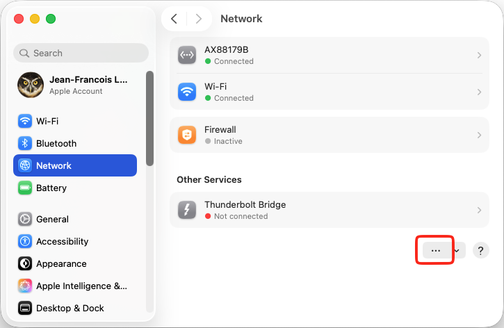
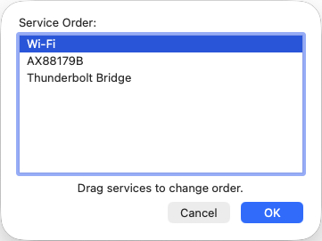

# Simultaneous Ethernet and Wi-Fi

Say you want to stream the competition with scoreboards. The streaming computer must talk to the local network to get the scoreboards (and if using networked cameras, to get the video).  But it must also talk to the Internet to go to the streaming service.

- Unless the WiFi is absolutely brilliant, you would not run the competition in the cloud and stream on the same WiFi.  You will normally run locally on a laptop connected to your own router.
- A common situation is that there is only WiFi Internet access at the facility, with no wired access.  Since there is no wired access, you cannot connect the router to the internet.  
- There is no Internet access at the facility, so you need to use a phone hotspot to reach the Internet.

### macOS

In macOS, the preferred way is to make WiFi the default connection.  Use the "System Settings" application and select Network.



Select "Set Service Order" in the menu that comes up, and drag WiFi to the first position.




### Windows

Windows, by default, will route traffic over the Ethernet connection because wired connections are listed as faster than wifi.  Normal home or gaming routers advertize themselves as gateways to the world even when they are not connected to the Internet. The trick is to make Windows forget about this route, so it uses the WiFi instead

1. Click on the Start menu and type `cmd`At the right, you will pick the option `Run as Administrator`
   

2. Type the following command 

   ````
   route delete 0.0.0.0
   ````

    This deletes the active default route (the Ethernet one)

Rebooting will restore the normal priority.  If you need this to be permanent, you need to change interface metrics instead, and you can ask ChatGPT/Gemini/Copilot/Claude and the like for steps.

### Raspberry Pi and Linux

The idea is to remove the route to the internet that comes from the router, so that no Internet traffic goes over the wired Ethernet connection.   The traffic destined to the LAN will always go to the wired connection anyway because that is a direct match.

```
nmcli connection modify eth0 ipv4.never-default yes
nmcli connection up eth0
```

After the competition, to restore going to the Internet over the wired connection,

```
nmcli connection modify eth0 ipv4.never-default no
nmcli connection up eth0
```

### 