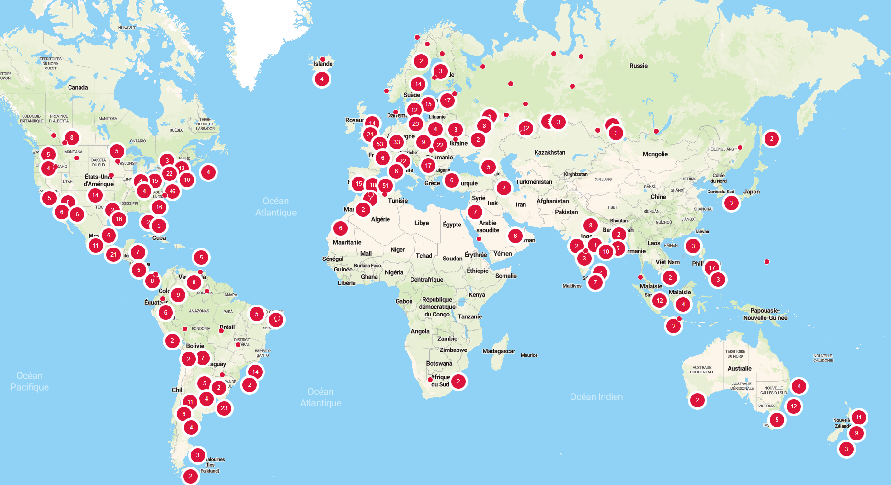

# owlcms: Olympic Weightlifting Competition Management System 

> **The full-range solution for running competitions**
>
> This free application is a *fully-compliant* weightlifting competition management system that has been used worldwide to manage competitions of all sizes, from club meets to international championships.   Click here for an [overview of features](#features).
>
> **Simple and automatic**
>
> Usage is simple enough that you can run a small club meet with just a single laptop, or a regional meet with only everyday electronics (a couple of laptops and TVs, some phones).
>
> The program automatically computes the lifting order, sets the clock correctly and enforces the rules for weight changes.  The announcer always sees the lifting order and the information about the current athlete.
>
> **On-site or Cloud**
>
> You can run the program on a laptop at the competition site.  Or if you prefer, in the cloud, without having to install anything, using *free* hosting services.

## Gallery

<table>
<tr><td></td><td>Current Usage <a href="https://www.google.com/maps/d/embed?mid=1cFqfyfoF_RSoM56GewSPDWbuoHihsw4&ehbc=2E312F&ll=29.63705469324934%2C18.91643749999993&z=3" target="_blank">Click on image for an interactive map</a>. The owlcms competition management system is currently in use in over 75 federations.  See here for <a href="./#/Countries">a list</a></td></tr>
<tr><td></img></td><td>USA National Championships 1500 athletes, 9 days (U11, U13, U15, U17, U20, U23, U25, Open and Adaptive championships)</td></tr>
<tr><td></img></td><td>National Competition, El Salvador. A simple setup with everyday electronics.</td></tr>
<tr><td></img></td><td>Club meet, Chelles, France. Supports mixed-gender kid groups.  Attempt board shows correct loading for 5kg/10kg bars and 2.5kg/5kg large plates.</td></tr>
<tr><td></img></td><td>Canadian Senior Championship, Kelowna, Canada. A full-scale national championship.</td></tr>
<tr><td></img></td><td>PanAm Masters Championship, Gaspé, Canada. The program has full support of Masters rules and coefficients.</td></tr>
<tr><td></img></td><td>Multiple simultaneous age groups (South American Championships, Guayaquil, Ecuador)   Built-in customizable live streaming/TV-oriented displays.</td></tr>
<tr><td></img></td><td>PanAm Junior and SouthAmerican  U20/U17/U15 Championships, Lima, Peru. The program  supports simultaneous platforms and displays the multiple rankings for multiple concurrent age group competitions</td></tr>
<tr><td></img></td><td>BRICS Games 2024 Multi-national event.</td></tr>
</table>

## Downloads and Installation

Most people run the program on a laptop at the competition site ([overview](InstallationOverview#stand-alone-laptop-installation))

- [Windows Stand-alone Installation](LocalWindowsSetup)
- [Linux, Raspberry or Mac Stand-alone Installation](LocalLinuxMacSetup)

You can also run the program in the cloud, in which case you don't have to install anything and can run your consoles and displays directly from the Internet.

- [Cloud-based installation](InstallationOverview#cloud-based-installation)

## Features

The following list is a sampling of the many features available.  <u>*Click on the images if you wish to view them full-sized*</u>.

- Run a **regular** or **masters** competition, with or without a **jury**.

- **State-of-the-art technology and high performance**: As an example, there is negligible CPU load and disk usage when [running a benchmark](https://groups.google.com/g/owlcms/c/57Ve5hUmMRM/m/T-NK8XkUBAAJ) with over 1150 athletes in 81 sessions spread over 4 simultaneous platforms, with athletes lifting at 8 times the normal rate. The system uses a modern, fully integrated web-based architecture and data is stored in a true relational database.

- Ability to run locally or in the [**cloud**](EquipmentSetup#cloud-access-over-the-internet).  Decisions, timers and sounds are handled locally in the browser to provide better feedback.

- **[Scoreboard](Displays#scoreboard)** for the public or warm-up room display.  

     - Current and next lifters are highlighted. 

     -  Leaders from current and previous groups can be shown for multi-group competitions. 

     - The leaders and records sections can be shown or hidden on demand.

     - The ranks for the lifts are shown when medals are awarded for each lift

     

     - The top part of the scoreboard contains the same information as the attempt board, and shows the down signal and decisions.

     

- **[Lifting order display](Displays#lifting-order)**. Useful for the marshal and for regional championships to help newer coaches.  All scoreboards can be displayed with black-on-white or white-on-black depending on the lighting conditions.

    
    
- **Multiple age group display**: If athletes can win medals in several categories, a multi-rank scoreboard is available

    

- [**Announcer and Marshal**](Announcing) screens 

    - The announcer gets all the necessary information clearly laid out.  Athletes are shown in lifting order, with highlights for the current athlete, the next athlete, and the athlete who lifted previously.  Indications are given for the weight required and when changes by the marshal on the current athlete.  All important events are notified (withrawals, record attempts, jury deliberations, etc.)
      
    - For the Marshal, the information about lifts is laid out as on the official cards.  Messages are given for late changes, and the changes are checked for correctness relative to the lifting order. The Marshal also sees the decisions as they are given.  For small competitions, the announcer can also act as marshal.  

- [**Timekeeping**](Announcing#Starting_the_clock) Time can either be [managed by the announcer](Announcing#Starting-the-clock)  (useful for smaller meets) or a dedicated [timekeeper screen](Announcing#Timekeeper) can be used. The timekeeper screen can be conveniently operated from a phone or tablet.

    

- **[Attempt Board](Displays#attempt-board)** showing current athlete information, remaining time, weight requested, down signal and decision.

       

- **Support for refereeing devices**

  - [**Mobile phones or tablets**](Refereeing#mobile-device-refereeing) The easiest way to get started is to use phones or tablets. 
    
      
    
  - [**Button keypads**](Refereeing#usb-or-bluetooth-keypads). Many people prefer using actual buttons. Any USB or Bluetooth keypad that can be programmed to generate the digits 0 to 9 can be used to enter decisions (you can buy or build you own, see [this link](Refereeing#usb-or-bluetooth-keypads))
    
        
    
  - [**Fully compliant devices**](Refereeing#full-feedback-keypad)  The IWF technical rules and regulations (TCRR) state requirements for refereeing and jury devices, notably regarding notifications to referees.  You can [buy commercial devices](https://blue-owl.nemikor.com) that are fully compliant or build your own. [Free do-it-yourself schematics
   and software](https://github.com/jflamy/owlcms-firmata/tree/v24?tab=readme-ov-file#owlcms-firmata) using low-cost Arduino boards are available.

  

- **[Athlete-facing display](Displays#attempt-board)** (the decision display matches the referee positions as seen from platform). Refereeing keypads are typically connected to this laptop.

     

- **[Records](Records)**  Record information can be provided using Excel files. Records for multiple federations and events can be loaded.  Record is then shown on the scoreboards, and notifications are given to the officials when records are attempted or set.  If a record is improved, the record information is updated.

- [**Integration with video streaming software**](OBS). Video-oriented layouts are included that can be customized using standard Web design techniques to achieve a competition-specific look.  Because the layouts are generated by the program itself, there is no delay and no risk of discrepency, and no additional work required at competition time.
    

- [**3 and 5-person jury**](Refereeing#jury).  Jury members see referee decisions as they happen. Jury members see their vote outcome once all jurors have voted. 

    

- **[Athlete Registration](Registration) and [Weigh-in](WeighIn) screens**, including production of **[weigh-in sheet](WeighIn#starting-weight-sheet)** with starting weights and **[athlete cards](WeighIn#athlete-cards)**.

    

- [**Upload of registration sheet**](Registration#uploading-a-list-of-athletes) Upload a list of athletes with their team, group, entry totals etc. (same format as owlcms2, in either xls or xlsx format)

    

- Multiple **[Simultaneous age divisions](Preparation#defining-age-divisions-and-categories)**: ability to award separate medals according to age division (e.g. youth vs junior vs senior) .  Simultaneous inclusion of Masters and non-masters groups athletes is possible.

     

- [**Competition Parameters**](Preparation#competition-information) :  screens for defining a competition (general info, location, organizer, etc.) and special rules that apply (for example, enforcing or not the 20kg rule, etc.)

    

- **[Multiple fields of play](Preparation#defining-fields-of-play-platforms)** (platforms): simultaneous competition platforms within the same competition.

  

- [**Team Competitions and Sinclair Competitions**](Displays#Top-Teams-Scoreboard).  Team Results are computed in either the IWF points system or as a sum of Sinclair scores. The competition secretary has access to the full details.

  
  
    

- **[Countdown timer for breaks](Announcing#breaks)** (before introduction, before first snatch, break before clean and jerk, technical break)

    

- Production of **[group results (protocol sheets)](Documents#group-results)** and of the **[final result package](Documents#competition-package)**

    

- Option to treat the competition as a **[Masters competition](Preparation#masters)** with proper processing of age groups (older age groups presented first)

- **[Video Streaming Scene Switching](OBSSceneSwitching)** When using OBS (or similar software) to stream a competition, a special status window can be monitored to switch scenes, trigger replays, or provide information as to the course of the competition (for example, jury deliberation, etc.)

- [**Multiple languages**](Preparation#display-language). Currently English, French, Spanish (multiple variants), Danish, Swedish, German, Portuguese, Romanian, Hungarian, Russian, Finnish and Armenian.

- **[Color and Visual Styling Customization](Styles)**  The colors of the displays are controlled by Web-standard CSS stylesheets, the format used by web designers world wide. A tutorial is given for the common case of adjusting the color scheme to local preferences.

    

- Etc.  Refer to the side menu for the full list of topics.

## Support

- [Discussion list](https://groups.google.com/forum/#!forum/owlcms)  If you wish to discuss the program or ask questions, please add yourself to this discussion [group](https://groups.google.com/forum/#!forum/owlcms).  You can withdraw at any time.
- [Issues and Feature Requests](https://github.com/jflamy/owlcms4/issues)  See the Project Board below to see what we are working on.
- [Project board](https://github.com/users/jflamy/projects/4/views/1) This shows what we are working on, and our work priorities.  Check here first, we may actually already be working on it
