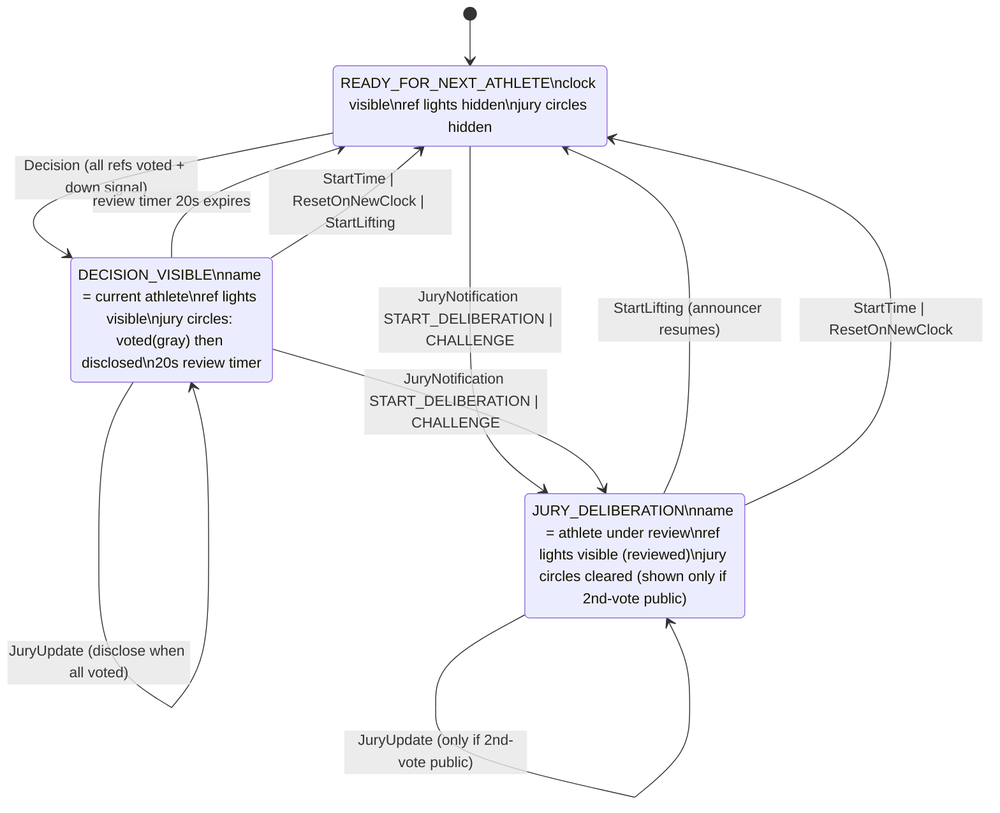

<!-- markdownlint-disable -->
# Decision Block — Behavioral Spec

Status: **DRAFT for review**
Scope: the bottom "decision section" of the results scoreboard (`Results` / `BaseResults`),
feature switch `DECISION_SECTION`.

This document is the single source of truth for **what the decision block shows and when**.
It is written in terms of FOP / UI events so it can be implemented as one state machine
(`DecisionBlockState`) that `Results.java` renders from, and unit-tested against event
scenarios (no Vaadin objects in the tests).

---

## 1. Visual elements

The decision block is composed of four independent visual pieces:

| # | Element | Driven by | Notes |
|---|---------|-----------|-------|
| 1 | **Clock** (decision-section timer) | `decisionSectionDecisionActive == false` | Shown only when no decision/review is being displayed. |
| 2 | **Referee decision lights** | `dsRefereeDecisions` (`DecisionBlockDecisionElement`) | white / red per referee; in `READY_FOR_NEXT_ATHLETE` they render as **empty** (blank slots), not the previous athlete's colors, even though the element still holds the previous decision values. |
| 3 | **Jury vote circles** | `juryDecisions` property (rendered in `Results.js`) | `empty` → `voted` (gray, undisclosed) → `white`/`red` (disclosed). |
| 4 | **Athlete-under-review name** | `decisionSectionDecisionActive == true` + name | Replaces the clock while a decision/review is displayed. |

Key rule: **"holds a value" ≠ "is shown".** In `READY_FOR_NEXT_ATHLETE` the referee and jury
elements may still contain the previous athlete's values, but the block renders them as **empty**
(blank slots), never the previous colors. What is displayed is a property of the *state*, not of
the underlying element data.

---

## 2. States

### `READY_FOR_NEXT_ATHLETE` (idle / clock mode)
- Clock: **visible**.
- Referee lights: **empty** — rendered as blank slots even if the element still holds the previous
  athlete's decision values.
- Jury circles: **empty / hidden** — rendered blank even if the element still holds previous votes.
- Athlete-under-review name: **hidden**.
- The clock may be started, stopped, restarted, stopped… any number of times without leaving
  this state.

### `DECISION_VISIBLE` (referee + jury votes shown)
- Entered once **all 3 referees have voted** *and* the **down signal has been shown** according
  to the immediate-vs-delayed decision rules.
- Clock: hidden. Athlete name: **visible** (the athlete who just lifted).
- Referee lights: **visible** (the referee decision).
- Jury circles: **visible**:
  - jury members who have voted → `voted` (full gray, **not disclosed**);
  - jury members who have not voted → `empty`.
- When **all jury members have voted**, disclose the jury decisions (`white`/`red`).
- A **20-second review timer** runs. If nothing else happens before it expires →
  `READY_FOR_NEXT_ATHLETE`.

### `JURY_DELIBERATION` (jury deliberation or challenge)
- Entered from any state on a jury-deliberation or challenge notification.
- Athlete name: **visible** — the **athlete under review** (referee decisions for that athlete are
  shown again).
- Referee lights: **visible** (the reviewed athlete's referee decision).
- Jury circles: **cleared**, and:
  - shown (live, then disclosed) **only if** the "second jury vote is public" toggle is on
    (`DECISION_SECTION_SHOW_BOTH_JURY_VOTES`);
  - hidden otherwise.
- The state persists through the whole deliberation/challenge. The verdict does **not**
  automatically leave this state.
- Leaves the state only when the **announcer resumes competition** (`StartLifting`) →
  `READY_FOR_NEXT_ATHLETE`.

---

## 3. Event → transition table

Events are `UIEvent.*` posted by `FieldOfPlay`.

| Event | READY_FOR_NEXT_ATHLETE | DECISION_VISIBLE | JURY_DELIBERATION |
|-------|------------------------|------------------|-------------------|
| `Decision` (all refs voted + down signal shown) | → **DECISION_VISIBLE** | refresh lights | ignore |
| `DownSignal` | stay (wait for `Decision`) | ignore | ignore |
| `JuryUpdate` (member vote) | ignore | update circles; disclose when all voted | update circles only if second-vote-public toggle on |
| review timer (20 s) expires | — | → **READY_FOR_NEXT_ATHLETE** | — |
| `JuryNotification START_DELIBERATION` / `CHALLENGE` | → **JURY_DELIBERATION** | → **JURY_DELIBERATION** | reset circles, stay |
| `JuryNotification GOOD_LIFT` / `BAD_LIFT` | — | (verdict shown, stay until resume) | stay (wait for resume) |
| `JuryNotification END_JURY_BREAK` / `END_CHALLENGE` | stay | — | stay (wait for `StartLifting`) |
| `StartLifting` (announcer resumes) | stay | → **READY_FOR_NEXT_ATHLETE** | → **READY_FOR_NEXT_ATHLETE** |
| `StartTime` / `ResetOnNewClock` (clock for next athlete) | stay | → **READY_FOR_NEXT_ATHLETE** | → **READY_FOR_NEXT_ATHLETE** |

Notes:
- The **down signal** alone never makes the block visible; visibility waits for the referee
  `Decision` event (which respects immediate-vs-delayed rules).
- Entering `READY_FOR_NEXT_ATHLETE` renders the referee and jury elements as **empty**. It does
  not need to wipe their underlying data — the render is empty regardless, and the next
  `DECISION_VISIBLE` entry repopulates them.

---

## 4. State diagram

---

## 5. Reload / attach (derive state, no history)

When the page attaches or re-syncs, the state is derived from the current FOP state (there is no
event history to replay):

| FOP condition | Derived state |
|---------------|---------------|
| `state == DECISION_VISIBLE`, break type ∈ {JURY, CHALLENGE} | `JURY_DELIBERATION` |
| `state == BREAK`, break type ∈ {JURY, CHALLENGE} | `JURY_DELIBERATION` |
| `state == DECISION_VISIBLE` (normal) | `DECISION_VISIBLE` |
| anything else | `READY_FOR_NEXT_ATHLETE` |

---

## 6. Why a single state object

Today the block has **two authorities**: `dsRefereeDecisions` self-subscribes to the FOP bus
(`DecisionElementState` + its own `@Subscribe` methods, `resetOnClockStart=true`) **and**
`Results.java` also drives it from several handlers. The two race, which is why the lights are not
reliably hidden in `READY_FOR_NEXT_ATHLETE`.

Target design:
- One `DecisionBlockState` (plain Java, no Vaadin) owns the state + payload
  (reviewed athlete, referee decision, jury votes, toggle) and exposes `on(UIEvent…)` transitions.
- `dsRefereeDecisions` becomes a **pure renderer** (stop it self-subscribing for this display);
  it is driven only by the state machine.
- `Results.java` implements a thin **`DecisionSectionRenderer`** interface (`showClock`,
  `showRefLights`, `showJuryCircles`, `showAthleteUnderReview`, `hideAll`) whose scope is
  **only the decision section** — it does not govern the rest of `Results.java` (scoreboard grid,
  group info, ranks, etc.). `Results.java` implements this interface simply because it owns the
  `@Id` handles to the decision-section elements; the interface is a narrow rendering contract for
  the decision block alone. It just renders the current snapshot.
- Unit tests feed the event scenarios in §3 and assert the resulting state + rendered snapshot.

---

## 7. Open questions for review

1. **Review timer = 20 s fixed**, or tied to `decisionVisibleDuration` / a config value?
2. In `DECISION_VISIBLE`, if a **new clock starts** for the next athlete before the 20 s expire,
   we go to `READY_FOR_NEXT_ATHLETE` immediately — confirm that is desired (vs. keeping the
   decision up for the full 20 s).
3. During `JURY_DELIBERATION` with the 2nd-vote-public toggle **off**, jury circles are fully
   hidden (not gray). Confirm.
4. `END_JURY_BREAK` / `END_CHALLENGE` do **not** by themselves return to ready — we wait for the
   announcer's `StartLifting`. Confirm this matches operational reality (is there ever an
   end-break without a subsequent start-lifting?).
