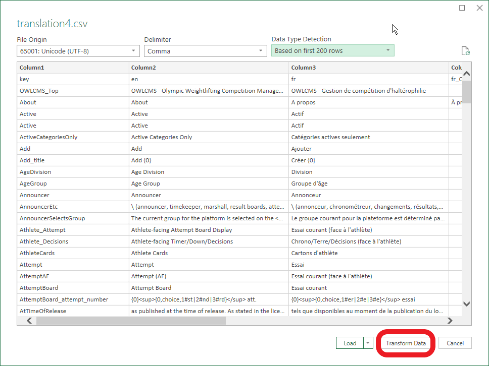

# Translation Instructions

1. **Right-click** on this link and do a **Save As** under the name `translation4.csv`
   https://raw.githubusercontent.com/jflamy/owlcms4/develop/owlcms/src/main/resources/i18n/translation4.csv
3. Open using Excel by double-clicking on the file. Depending on you configurations, either
   1. the file opens correctly, in several columns, and you see French, Danish, Russian characters. If so, proceed to step 4  OR
   2. the CSV file does not open with one column per language: everything is in column A.  See the instructions at the bottom of the page.
3. Critical: When SAVING you will need to make sure to use the "UTF-8 CSV" option
   
4. Each column represents a language.  You may add your own language by adding a column at the end; use the ISO 639-1 two-letter code for your language -- see the list in https://en.wikipedia.org/wiki/List_of_ISO_639-1_codes  (for example, da is Danish, fr is French, etc.)

## Testing your translations:

   1. Add a column for your language in the .csv 

   2. Translate a few items by filling in the cells in the csv and save it.

   3. Locate your *installation directory* -- where owlcms.jar is found.

   4. Create a folder `local\i18n` inside the *installation directory* and copy the .csv in that directory

   5. Open a command shell in the *installation directory*
      1. Start the program as follows
         ```java -cp local;owlcms.jar app.owlcms.Main```
         (This tells the program to look for files inside the "local" folder prior to looking for the default strings)
      
   6. Any string you have not translated will come out as `!ru: SomeCode`
      This means that there is no value in the row `SomeCode` for the language `ru`
      
      

## Workaround: Forcing Excel to Read a UTF-8 CSV

<u>This is only needed if Excel cannot read your file</u>

1. Open Excel from the start menu -- do NOT double-click on the file

2. Use the Data / From Text/CSV option to open the file

   

3. A wizard will run and detect the settings. Unfortunately, it cannot guess that the top line is used as a header line, so we click `Transform Data` at the bottom.

3. Select the `Use first row as headers` option
   
4. Select `Close and Load` to reload with the header line
   
5. Go to the Design menu and select `Convert to Range` to go back to normal Excel style.  You may close the Queries and Connections panel at the right by clicking X
   
6. Critical: When SAVING make sure to use "Save As" and use the "UTF-8 CSV" option
   